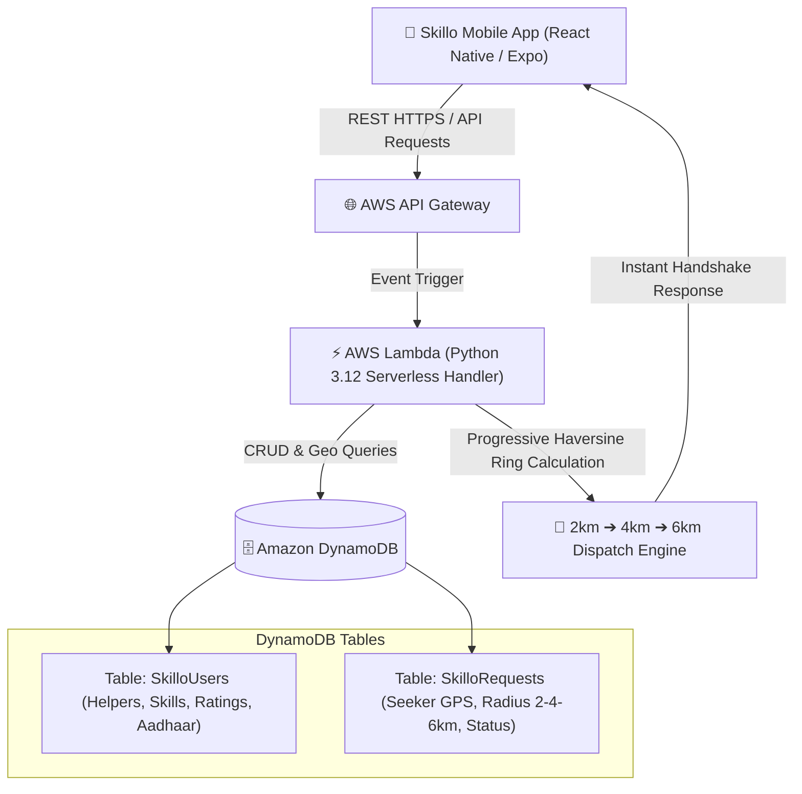

# ⚡ SKILLO
### Hyperlocal On-the-Go Emergency & Skill Dispatch Network
> **WeMakeDevs × AWS Hackathon 2026: First Commit — Bharat Builds Tour**  
> **Builder:** **Pradeep Kumar L** (Executive M.Tech in AI, ML & Data Science, PES University, Bangalore)  
> **Stack:** React Native (Expo) • AWS Serverless (AWS SAM + Lambda + DynamoDB + API Gateway) • OpenStreetMap

---

## 📌 1. The Problem
When a roadside breakdown, medical distress, or urgent manual situation occurs:
- Help is often sitting in a car, train, or cafe just **500 meters away** (a travelling doctor, an off-duty mechanic, an emergency electrician, or someone available for quick 1-hour physical help).
- Traditional gig platforms force static vendor locations, high 20–30% platform commissions, and delayed scheduling.
- **There is no real-time way to ping and dispatch travelling, verified skilled responders nearby in expanding radius rings.**

---

## 💡 2. The Solution
**Skillo** turns travelling skilled individuals into a roaming safety net:
1. **Multi-Skill Emergency & Task Support:**
   - 🩺 **Doctor / Medical Emergency**: CPR, accident triage, first-aid.
   - 🔧 **Roadside Mechanic**: Flat tyres, battery jumps, engine stalling, towing.
   - ⏱️ **Quick Manual Help (1-hour)**: Emergency luggage moving, short-duration lifting/shifting.
   - ⚡ **Electrician / 🚰 Plumber**: Emergency short-circuit or pipe burst.
2. **Progressive Geo-Scan (2km $\to$ 4km $\to$ 6km):**
   - Automatically scans within **2 km**. If no responder accepts within 1 minute, the radius seamlessly expands to **4 km**, then **6 km**.
3. **Instant Handshake & Zero Commission:**
   - The first available responder to accept unlocks direct phone contact, WhatsApp messaging, and live location coordinates.
   - Seekers pay responders directly (Cash / UPI QR) with **0% platform commission**.
4. **Trust & Verification:**
   - Aadhaar e-KYC verified badges (`UIDAI_GOV_VERIFIED`).
   - Mutual 1–5 ⭐ rating score recorded in AWS DynamoDB for both Seekers and Helpers.
   - Minimal ₹49/mo platform subscription model for helpers.

---

## ☁️ 3. Where AWS Fits (Architecture)



- **AWS SAM (Serverless Application Model)**: Defines Infrastructure as Code (`template.yaml`).
- **AWS Lambda (Python 3.12)**: Handles stateless request routing, Haversine geospatial radius computation, and Aadhaar OTP verification.
- **Amazon DynamoDB**: Low-latency NoSQL database storing roaming helper coordinates, active request lifecycle, and mutual rating scores.
- **LocalStack / SAM CLI**: Enables local zero-cost cloud emulation on Windows/Linux without AWS billing.

---

## 🛠️ 4. Open-Source & AI Tools Used
- **AI Coding Tools Used**: Google Antigravity (Agentic AI pair-programming assistant by Google DeepMind) — *used for accelerated development, boilerplate generation, and rapid UI/backend iteration*.
- **React Native (Expo)**: Cross-platform mobile client for Android, iOS, and Web.
- **OpenStreetMap / MapLibre**: Open-source, zero-cost map tiles and location visualization.
- **AWS SAM CLI & LocalStack**: Open-source tooling for running and testing serverless AWS infrastructure locally.
- **Python 3.12 Standard Library**: Math/Haversine calculations without heavy external GIS dependencies.

---

## 🚀 5. Quick Start Guide

### Step 1: Start the AWS Serverless Backend
```bash
cd skillo-backend
python dev_server.py
```
*(Runs at `http://localhost:3000`. You can also run `sam local start-api` with Docker).*

### Step 2: Start the Mobile App
```bash
cd skillo-app
npm install
npm run web
```
- Press **`w`** in the terminal to view in your browser.
- Or install the **Expo Go** app on your phone and scan the terminal QR code.

---

## 🧪 6. Testing Key Flows

1. **Broadcast Request (Seeker Mode)**:
   - On the Home screen (`/`), select **"Doctor / Medical Emergency"** or **"Quick Manual Help"**.
   - Tap **"Broadcast Now"**.
   - Watch the radar scan ring 1 (2 km) and find travelling responders with ratings and Aadhaar badges.
2. **Instant Handshake**:
   - Tap **"Request & Instant Handshake"**.
   - View direct responder contact details, Call / WhatsApp buttons, and peer-to-peer payment notice.
   - Submit a **5-Star Rating** to update the AWS database score.
3. **Helper & Aadhaar Verification (`/explore`)**:
   - Toggle **Duty Mode (Online/Offline)**.
   - Test demo incoming alert from **Akshatha M** (`+91 97421 23450`), inspect the **Aadhaar e-KYC Verified badge** (`🛡️ KYC Verified ✓`) and **⭐ 4.9 Average Citizen Score**.
   - Click **Accept & Assist** to instantly trigger native phone dialer call to the citizen.
   - Enter a 12-digit Aadhaar number and test OTP `123456` to receive the official `UIDAI_GOV_VERIFIED` badge.

---

## 🧠 7. What I Learned (Judging Criterion 03)
As an Executive M.Tech student in AI/ML & Data Science at PES University, Bangalore, this hackathon provided valuable real-world cloud engineering experience:
1. **Infrastructure as Code with AWS SAM**: Transitioning from ad-hoc scripts to writing production-ready serverless templates (`template.yaml`) declaring Lambda functions, DynamoDB tables, and API Gateway resources.
2. **Stateless Geospatial Calculation**: Computing progressive Haversine radius expansions (2km $\to$ 4km $\to$ 6km) inside AWS Lambda with sub-millisecond execution times and zero idle server costs.
3. **Privacy-Preserving Aadhaar e-KYC**: Architecting a UIDAI OTP-based verification flow that establishes mutual trust between citizens and roaming responders without storing raw 12-digit Aadhaar numbers in databases.

---

## 📜 8. License
This project is open-source and licensed under the [MIT License](LICENSE) — Copyright (c) 2026 Pradeep Kumar L.
